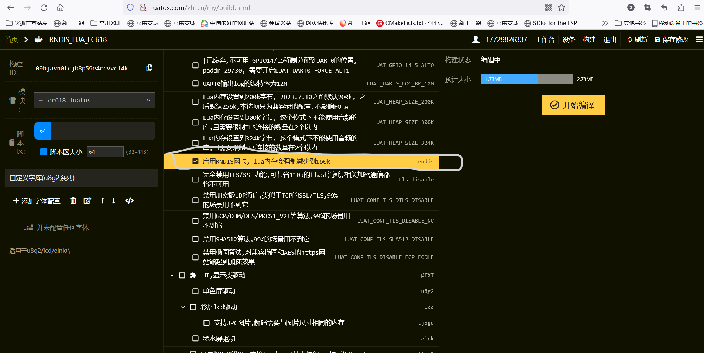

# 固件列表

固件的目录命名规则为 [固件编号]-[固件名称] 。

- [001-base](001-base):基础模板。

# 约定

Lua作为脚本语言，是一种解释型语言，相对于编译型语言，可能更难在编写时检查出错误(如没有运行到的语句不会报错)。

为了减少错误的产生,就需要在编写程序前进行一些约定。

- 文件名不能任意命名,有些文件名具有特殊的含义。
- 对于需要传递引用(类似使用C语言指针达到的效果)的变量，需要封装成table。
- 对于临时变量一定要添加上local。
- 尽量将变量放入table中(此table可由全局变量引用),可将table用作C++的命名空间类似的功能,由此可减少因不同作用的变量的变量名重复导致的错误。
- 某些全局变量名具有特殊含义,用户不能任意命名全局变量名。

## 文件名

- 文件名以`.init`结尾的lua文件作为初始化文件自动加载，并且自动执行init函数(若有)。
- 文件名以`.lib`结尾的lua文件将作为库文件加载,并且自动放入_G(自动除去.lib后缀)
- 文件名以`.class`结尾的lua文件表示一个类文件，可通过`new(文件路径)`多次加载,其中文件路径是文件的全路径，对于Air780E(G)而言，需要添加`/luadb/`前缀。

### 初始化文件

要求如下:

- 文件必须返回table
- table中必须包含`init`函数

作为初始化文件，主要特点如下:

- 调用table时，所有的库文件均已加载，因此均可调用。

- 初始化返回的table为临时table，可能会被垃圾回收。

### 库文件

要求如下:

- 文件必须返回table。
- 文件中的table变量名需要与文件名(不包含后缀名)一致。
- 文件名不得与已有全局变量名、模块名等重复,且应遵循Lua变量名命名规则（如除了后缀名含有点，不应包含其它的点）。

作为库文件,主要特点如下:

- 库文件返回的table将加入_G,一般情况下不会被垃圾回收。
- 库文件加载后，可直接通过文件名(不包含后缀名)访问库。

### 类文件

要求如下:

- 需要加载`new.lib`库。
- 一个文件只能包含一个类。
- 文件必须返回table，返回的table即为实例对象。
- table中不得包含`delete`函数，进行new操作时会自动添加`delete`函数。
- 类文件可多次加载，因此需要注意对全局变量的访问，最好不要修改全局变量。
- 类中不要使用`this`或者以`this`结尾的变量名(包括成员变量的变量名),常量字符串中也不要包含`this.`，用户可使用`this.`访问当前实例对象(一般用于设置回调函数)。
- 调用`delete`函数时需要确保后续不会再使用该实例对象。

作为类文件，主要特点如下:

- 类文件可通过`new(文件路径)`实例化多个对象，new的返回值即为实例对象，失败时返回nil。
- 类文件中的函数推荐将`self`作为第一个参数(设置其它模块的回调函数除外),这样可以采用`变量名:函数名`调用函数。
- 类文件可通过`this.`访问实例对象，一般用于设置其它模块的回调函数。

## 全局变量名

注意:变量名应遵循Lua变量名命名规则，且不得与其它模块(如系统库、官方扩展库等)重名。

- app:类型为table,用于存储app信息，主要用于系统消息订阅的回调的函数的消息存储。

# 底包

若无特殊说明,默认采用LuatOS-SoC_Vxxxx_EC618_TTS_ONCHIP.soc作为底包,其中Vxxxx表示版本号，如版本1109则为V1109。

注意:使用LuaTools自动下载的底包可能没有RNDIS功能,不能通过USB(RNDIS)上网。需要到[http://luatos.com](http://luatos.com)登录后定制固件。

