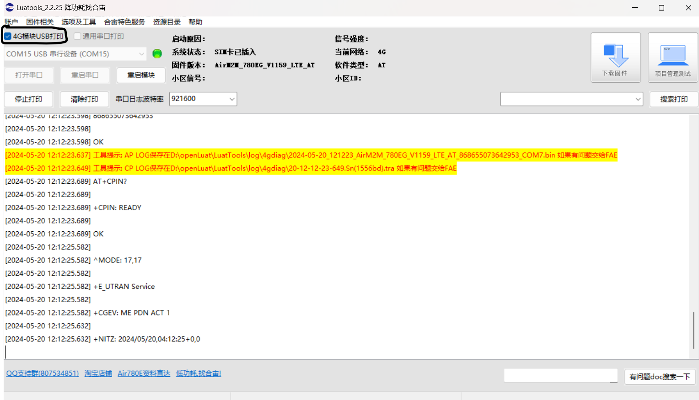
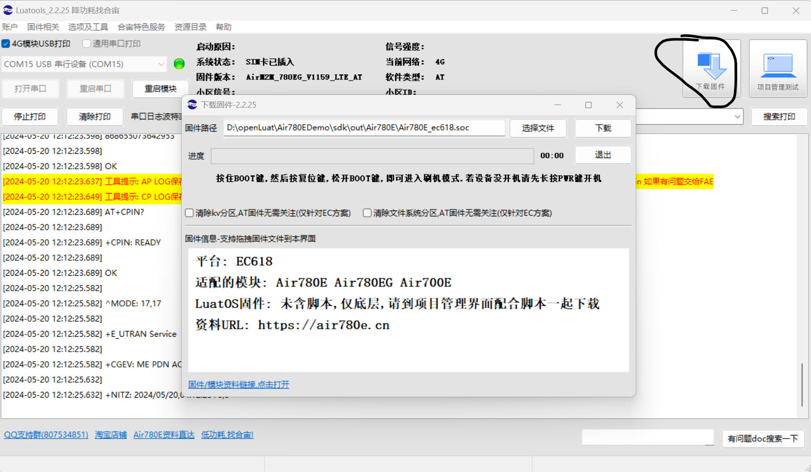
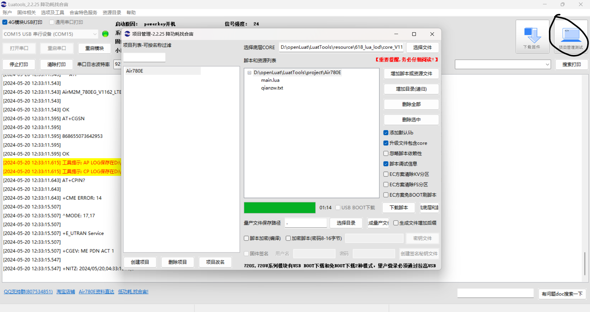

# 目录说明

- [Lua](Lua):采用Lua语言编写的固件。
- [C](C):采用C/C++语言编写的固件。

# 工具

主要使用的操作系统：

- Windows 10（及更新的windows操作系统）。

合宙官方相关工具下载地址:[https://wiki.luatos.com/pages/tools.html](https://wiki.luatos.com/pages/tools.html)

## LuaTools

无论是C语言开发还是Lua开发，均需要使用LuaTools工具下载。

当LuaTools第一次启动会下载一些资源文件，目录如下:

- resource:下载的资源目录，包括但不限于AT固件、Lua程序底包、脚本示例等。resource/618_lua_lod为Air780E的Lua程序底包所在目录。
- project:Lua项目的工程目录，保存一些工程配置。

### 调试

勾选 **4G模块USB打印**,当4G模块连接USB信息时，将自动打印调试信息。

### C语言固件操作

对于采用CSDK开发的固件，仅仅需要使用LuaTools下载固件。

### Lua语言固件说明

对于采用Lua语言开发的固件，LuaTools可进行项目管理、底包操作(替换、更新)、量产固件生成（量产固件采用同CSDK开发的固件相似的下载操作）。

